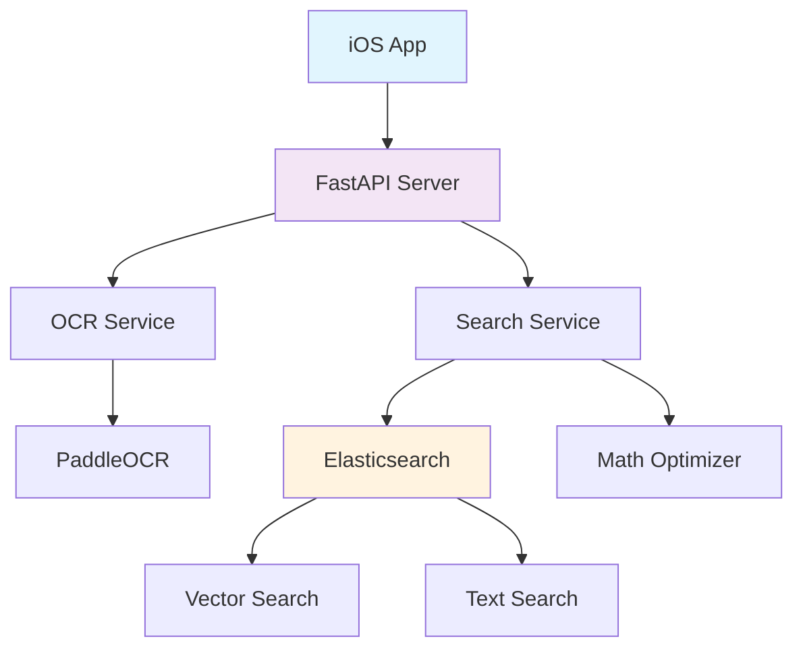

# CAIE Search Backend

> **智能搜题系统后端** - 基于 Elasticsearch + PaddleOCR 的 CAIE A-Level 数学题库搜索引擎

[](https://www.python.org/downloads/)
[](https://fastapi.tiangolo.com/)
[](https://www.elastic.co/)
[](https://docs.docker.com/compose/)

## 🌟 项目简介

CAIE Search Backend 是一个专为 CAIE A-Level 数学考试设计的智能搜题系统。通过先进的 OCR 技术和 Elasticsearch 搜索引擎，为学生提供快速、准确的题目搜索和答案匹配服务。

### 🎯 核心特性

- **🔍 拍照搜题**: 支持数学公式 OCR 识别，智能匹配历年真题
- **📝 文本搜索**: 关键词搜索 + 语义搜索，多维度匹配题目
- **📊 海量题库**: 涵盖 2001-2022 年 CAIE A-Level 数学真题
- **⚡ 实时响应**: 搜索响应时间 < 2 秒，OCR 识别准确率 85%+
- **🔗 答案匹配**: 自动关联 Question Paper 和 Mark Scheme

## 🚀 快速开始

### 📋 环境要求

- **Python**: 3.8 或更高版本
- **Docker Desktop**: 用于运行 Elasticsearch 和 Redis
- **内存**: 推荐 4GB+ 可用内存
- **IDE**: PyCharm 或 VS Code (推荐 PyCharm)

### ⚡ 一键部署

```bash
# 1. 克隆项目
git clone https://github.com/OOXXXX/caie-search-backend.git
cd caie-search-backend

# 2. 启动 Docker 服务
docker-compose up -d

# 3. 安装 Python 依赖
pip install -r requirements.txt

# 4. 处理数据并创建索引
python caie_math_processor.py

# 5. 启动 API 服务器
python main.py
```

### ✅ 验证部署

```bash
# 健康检查
curl http://localhost:8000/health

# 创建搜索索引
curl -X POST http://localhost:8000/admin/index

# 测试文本搜索
curl -X POST "http://localhost:8000/search/text" \
     -H "Content-Type: application/json" \
     -d '{"query": "differentiate", "limit": 3}'
```

访问 **API 文档**: http://localhost:8000/docs

## 📖 详细文档

- 📚 **[PyCharm 开发指南](./PYCHARM_GUIDE.md)** - 完整的本地开发配置
- 🔧 **[API 接口文档](http://localhost:8000/docs)** - 在线 API 文档
- 🗄️ **[Elasticsearch 面板](http://localhost:9200)** - 搜索引擎管理

## 🏗️ 系统架构



### 🔄 处理流程

1. **拍照搜题**: 图片 → OCR 识别 → 数学公式优化 → Elasticsearch 搜索 → 结果排序
2. **文本搜索**: 关键词 → 查询优化 → 多字段搜索 → 语义匹配 → 结果返回

## 📊 数据规模

| 指标 | 数值 | 说明 |
|------|------|------|
| **试卷数量** | 600+ | 2001-2022年历年真题 |
| **题目总数** | 3,000+ | 包含所有数学题目 |
| **索引大小** | ~100MB | Elasticsearch 索引 |
| **搜索延迟** | <2秒 | 平均响应时间 |
| **OCR 准确率** | 85%+ | 数学公式识别率 |

## 🔌 API 接口

### 📡 主要端点

| 端点 | 方法 | 功能 | 示例 |
|------|------|------|------|
| `/health` | GET | 系统健康检查 | 服务状态监控 |
| `/ocr` | POST | OCR 文字识别 | 图片转文字 |
| `/search/text` | POST | 文本搜索 | 关键词搜索题目 |
| `/search/image` | POST | 拍照搜题 | 图片搜索题目 |
| `/search/image/analysis` | POST | 详细分析搜索 | 包含匹配分析 |
| `/admin/index` | POST | 创建搜索索引 | 管理员操作 |
| `/admin/stats` | GET | 获取系统统计 | 数据统计 |

### 🔍 搜索示例

```bash
# 文本搜索
curl -X POST "http://localhost:8000/search/text" \
     -H "Content-Type: application/json" \
     -d '{
       "query": "find the derivative of x^2",
       "limit": 5,
       "filters": {"year": "2022"}
     }'

# 拍照搜题
curl -X POST "http://localhost:8000/search/image" \
     -H "Content-Type: multipart/form-data" \
     -F "file=@math_question.jpg" \
     -F "limit=10"
```

## 🐳 Docker 配置

### 服务组件

- **Elasticsearch 8.11**: 搜索引擎核心
- **Redis 7**: 缓存和会话存储
- **内存配置**: ES 512MB-1GB, 总需求 ~2GB

```yaml
# docker-compose.yml 主要配置
services:
  elasticsearch:
    image: docker.elastic.co/elasticsearch/elasticsearch:8.11.0
    environment:
      - "ES_JAVA_OPTS=-Xms512m -Xmx1024m"
      - discovery.type=single-node
      - xpack.security.enabled=false
  
  redis:
    image: redis:7-alpine
    ports:
      - "6379:6379"
```

## 💻 开发指南

### 🛠️ 本地开发设置

1. **PyCharm 配置**: 参考 [PYCHARM_GUIDE.md](./PYCHARM_GUIDE.md)
2. **虚拟环境**: 推荐使用 `venv` 创建独立环境
3. **依赖安装**: 使用清华源加速 `pip install -r requirements.txt -i https://pypi.tuna.tsinghua.edu.cn/simple`

### 🔧 核心模块

```python
# 主要组件
from ocr_service import OCRService              # OCR 识别服务
from search_service import SearchService        # Elasticsearch 搜索
from math_search_optimizer import MathSearchOptimizer  # 数学搜索优化
from caie_math_processor import CAIEMathProcessor      # 数据处理器
```

## 📱 iOS 集成

### Swift 配置示例

```swift
// API 基础配置
struct APIConfig {
    static let baseURL = "http://localhost:8000"  // 本地开发
    // static let baseURL = "https://your-domain.com"  // 生产环境
}

// 搜索请求
func searchByImage(_ image: UIImage) async throws -> [SearchResult] {
    // 实现拍照搜题逻辑
}
```

## 🚀 部署指南

### 💡 本地开发
- **成本**: 免费
- **配置**: Docker Desktop + Python 环境
- **性能**: 适合开发测试

### ☁️ 云端部署
- **推荐**: 腾讯云轻量应用服务器 2核4GB
- **成本**: ¥45-75/月
- **配置**: Docker + Nginx + SSL

## 🔧 故障排除

### 常见问题

#### Docker 启动失败
```bash
# 检查 Docker Desktop 是否运行
docker --version

# 增加内存分配 (Settings → Resources → Memory > 4GB)
# 重启 Docker Desktop
```

#### Elasticsearch 连接失败
```bash
# 检查容器状态
docker-compose ps

# 查看日志
docker-compose logs elasticsearch

# 重启服务
docker-compose restart elasticsearch
```

#### PaddleOCR 安装失败
```bash
# 使用国内镜像源
pip install paddleocr -i https://pypi.tuna.tsinghua.edu.cn/simple

# 如果 GPU 版本有问题，强制使用 CPU 版本
pip install paddlepaddle -i https://pypi.tuna.tsinghua.edu.cn/simple
```

#### 端口冲突
```bash
# 检查端口占用
lsof -i :8000
lsof -i :9200

# 修改端口配置
# 编辑 docker-compose.yml 和 main.py
```

## 📈 性能优化

### 🎯 搜索优化策略

1. **多字段搜索**: 题目内容 + 答案内容 + 关键词
2. **语义搜索**: 使用 sentence-transformers 进行向量匹配
3. **数学公式优化**: 特殊的数学符号和公式处理
4. **结果排序**: 基于相关性、年份、题型综合评分

### ⚡ 缓存策略

- **Redis 缓存**: OCR 结果和热门搜索
- **Elasticsearch 缓存**: 查询结果缓存
- **模型缓存**: 向量模型和 OCR 模型预加载

## 🤝 贡献指南

我们欢迎各种形式的贡献！

### 🔄 参与方式

1. **Fork** 项目仓库
2. **创建** 功能分支 (`git checkout -b feature/AmazingFeature`)
3. **提交** 更改 (`git commit -m 'Add some AmazingFeature'`)
4. **推送** 到分支 (`git push origin feature/AmazingFeature`)
5. **创建** Pull Request

### 📝 开发规范

- 代码风格: 遵循 PEP 8
- 测试要求: 新功能需要添加对应测试
- 文档更新: 重要更改需要更新文档

## 📄 开源协议

本项目采用 **MIT License** 开源协议。详见 [LICENSE](LICENSE) 文件。

---

<div align="center">

**⭐ 如果这个项目对你有帮助，请给个 Star！**

Made with ❤️ for CAIE A-Level Students

</div>